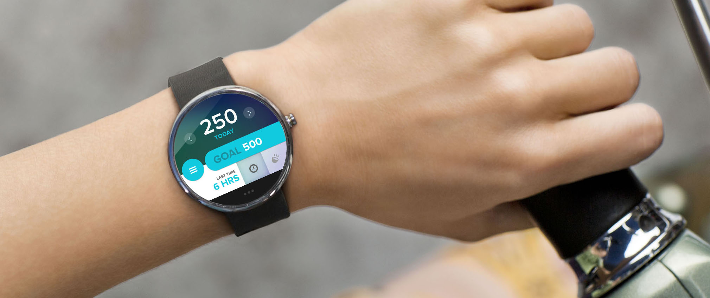

NailSafe
========

#Primary
- [ ] Update and store onto mobile from phone

#Secondary
- [ ] Set minimum height on mobile phones of the root view so as to not compress with the circular progress views
- [ ] Adding animations
- [ ] StartActivity.java on mobile has an error sensing if the mobile wear is connected
- [ ] Improve disable/enable states of buttons
- [ ] Show feeback during calibration if the wear disconnects
- [ ] Improve average calculation
- [ ] Normalize datastore keys i.e. CalibrationPosition, CalibrationFinished

#Note
- Renamed packaged due to a compatibility issues on my pc
